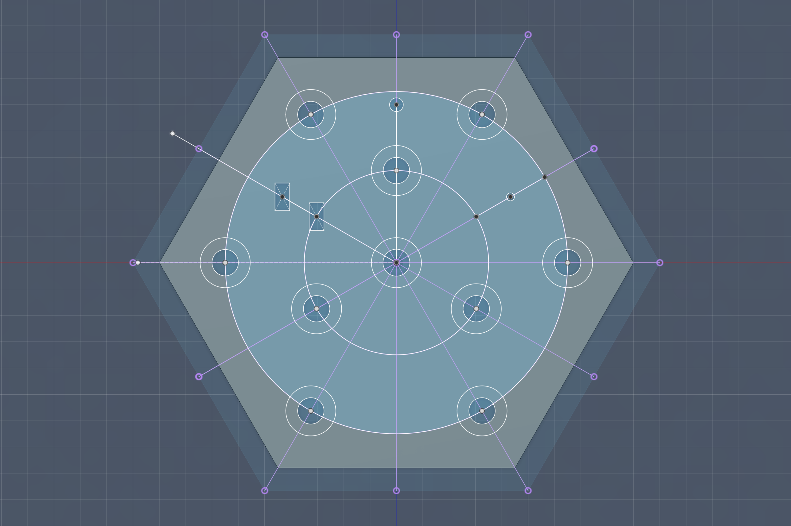
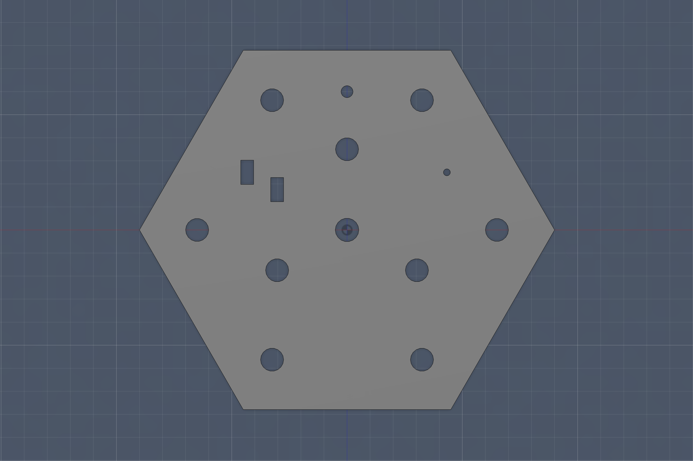
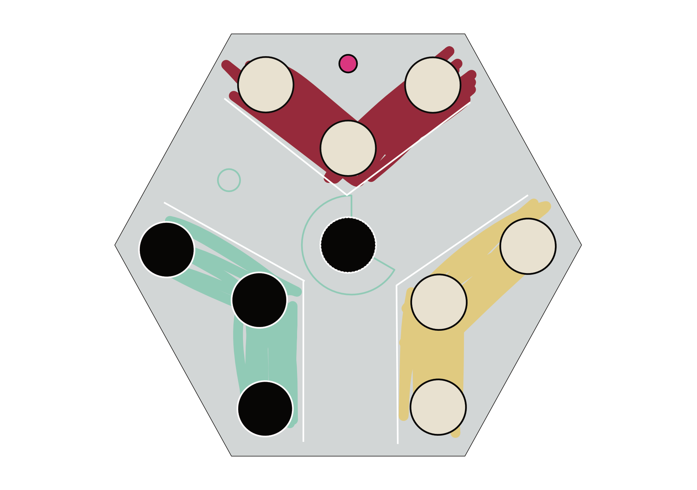
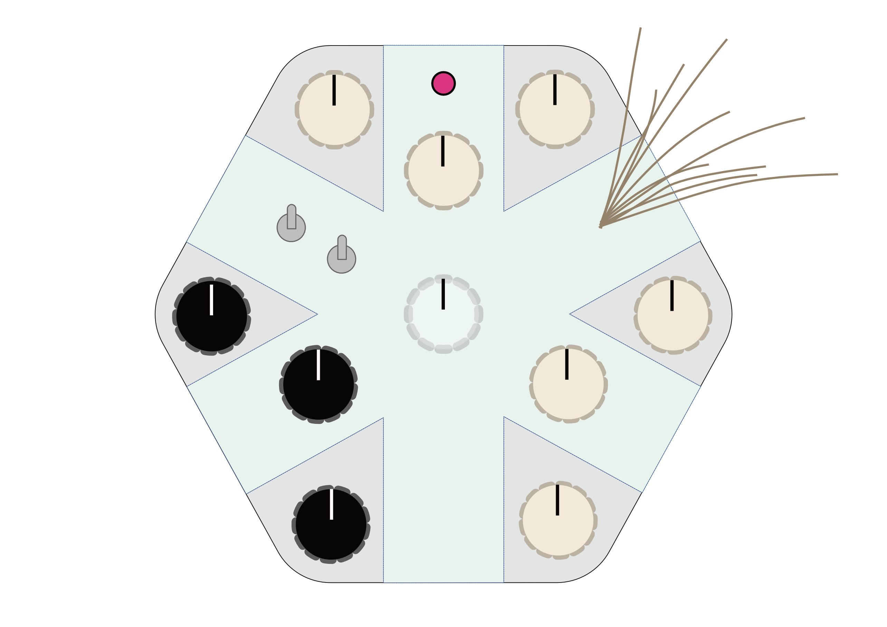

# Rhythm Machine

A two-stage **Euclidean drum machine** that lets you inject chaos into a programmed beat by hitting a vibration sensor's strings. Built on a **Teensy 4.0** + **Pure Data** by Noa Carlberg & Erik Esshagen.


## What it does

- **Two-stage Euclidean sequencing** — distributes steps, then triggers, evenly across the bar.
- **6 channels** (kick, snare, hi-hat, 2 percussion, conga/tom) and **2 sound banks** (808 / acoustic).
- **Chaos sensor** — a DIY piezo + guitar-string sensor randomizes parameters from 0% (knob value) to 100% (full range).
- **Per-channel** Moog-style filter, equal-power panning, volume and randomness.
- **Networked**: sends tempo to a partner arcade game and receives motion data back as chaos input.

## Hardware

Teensy 4.0 · 9× 10 kΩ pots (7 linear, 2 log) · 1 rotary switch (channel select) · 3 slide switches · custom piezo vibration sensor.

## Parameters

| | Range | | Range |
|---|---|---|---|
| BPM | 60–350 | Volume | 0–2 |
| Swing | 0–50% | Pan | 0–2 |
| Total steps | 0–16 | Sample | 1–3 |
| Channel steps | 0–total | Resonance | 0–4 |
| Hits | 0–steps | Cutoff | 0–15000 Hz |
| Offset | 0–(steps−1) | Randomness | 0–50% |

## Setup

1. Install Arduino IDE + Teensyduino, flash the sketch to the Teensy.
2. Install [Pure Data](https://puredata.info/), open the patch, match the serial port.
3. Connect over USB and start turning knobs.

```
firmware/   Teensy sketch        puredata/   sound engine
design/     Fusion files         images/     ← your photos
```






## Notes

Vibration sensor is a working proof of concept (a whisker sensor could replace it). Pure Data occasionally chokes when too many values change at once. Made for [course].
